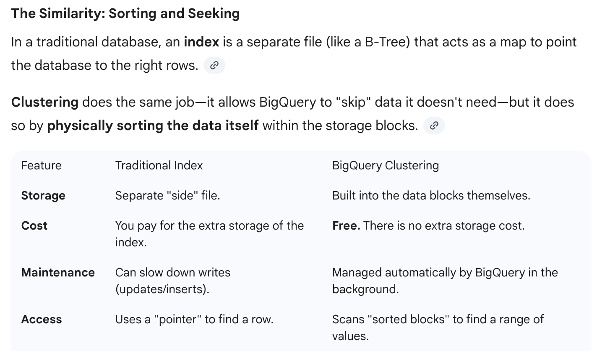

## Google Bigquery Partitioning and Clustering

Partitioning (commonly by date) splits the datasets into smaller chunks when a query is run (for ex with a WHERE clause on date), less data is scanned, this reduces cost as Bigquery charges per 1TB of data processed (5 dollars).

For even more efficieny we can then cluster on a column inside the partition so even less data is scanned.

"BigQuery pricing and query planning are based on bytes scanned, not rows returned."

Some topics discussed:
- When to choose partitioning over clustering and vice-versa
- What are the different criterias for choosing partitioning and clustering
- Automatic re-clustering

## BigQuery Best Practices

Cost Reduction:
- Avoid using "SELECT *". Intead specify the column names that you'll use as Bigquery is columnar storage so it will be cheaper to do that.
- Price your query before running it.
- Use clustered or partitioned tables

After asking gemini 'Isnt date considered high cardinality when partitioning?'
> Whether a date column is considered "high" or "low" cardinality depends entirely on the context of your data volume.
>
> In the world of BigQuery, cardinality is relative to the total number of rows. Here is why we treat dates as "low" cardinality in the context of partitioning:
>
> 1. The "Distinct Values" Ratio  
> If you have a table with 10 years of data, you have roughly 3,650 unique days.
>
> For a small table: 3,650 might feel like high cardinality.
>
> For BigQuery scales: If that table has 10 billion rows, those 3,650 values are actually very "low" cardinality compared to something like user_id, which might have 50 million unique values.
>
> 2. Physical vs. Logical Sorting  
> The reason we distinguish between them is based on how BigQuery stores the data:
>
> Partitioning (The "Folder" System): When you partition by date, BigQuery physically segments the data into separate units. It works best when there are fewer segments (BigQuery actually has a strict limit of 4,000 partitions per table). Because there are only ~365 days in a year, a date column fits perfectly within these limits.
>
> Clustering (The "Index" System): This is where you put your true high-cardinality data. If you tried to partition by user_id with 1 million users, BigQuery would crash because it can't create 1 million physical segments. But it can cluster by user_id easily.
>
> The "Cheat Code" Hierarchy  
> To visualize how this saves you money:
>
> Partitioning (Date): You query WHERE date = '2023-01-01'. BigQuery ignores 99.9% of the table and only opens the "folder" for that specific day.
>
> Clustering (User ID): Inside that specific day's "folder," BigQuery uses the high-cardinality cluster to jump straight to the specific rows for user_id = 12345.

